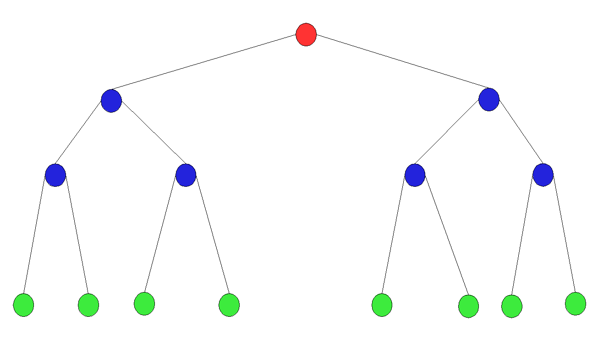

# Data Structures outline

[Go Back](0-welcome.md)

## Tree

Similar to linked lists, **Trees** are connected to multiple different nodes and are connected together by pointers. We will look at the following types of trees: **binary trees**, **binary search trees**, and **balanced binary search trees**

### Binary Tree

**Binary Tree**, a tree that links to no more than two **nodes**. In the picture below, the top node(red) is called the **root** node. The bottom nodes, nodes that do not connect to other nodes(green) are called **leaf** nodes. The node that has connected nodes (top blue) is called **parent** node. The node connected to the parent (bottom blue) are called **child** nodes.

Nodes that are left and right of any parent node form a **subtree**. There is always one root node in a tree.

### Binary Search Tree

**Binary Search Tree (BST)**, also called an *ordered binary tree* or *sorted binary tree*, is a type of non-linear data structure in which the nodes are arranged in a particular order. BST has the following properties: 

* The left subtree of a node has nodes which are only lesser than that node’s root.
* The right subtree of a node has nodes which are only greater than that node’s root.
* The left and right subtree must also be a binary search tree.

Non-linear data structure - data items that are not organized sequentially

### Balanced Binary Search Tree

## Common Stack Operation:

## Example Code in Python

## Problem to Solve

[Go Back](0-welcome.md)